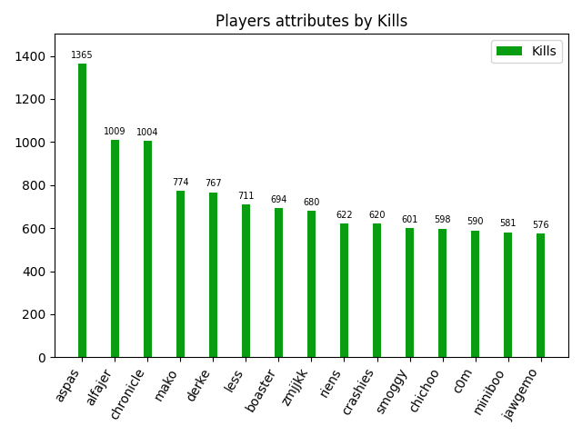

# VLR Stats Scraper

A lightweight Python tool that scrapes **player career statistics** from **VLR.gg** and exports them into a clean **JSON file** and **Bar Graphs**.  
Ideal for data analysis, visual comparisons, or game/data projects involving Valorant statistics.
Built with Python, Requests, BeautifulSoup, and Matplotlib.

---

## Included Tools

### 1. VLR Stats scraper (apps/scraper.py)

Scrapes player statistics directly from VLR.gg and exports them into structured JSON files.

### 2. VLR Stats Graph Generator (apps/gen_graph_bars.py)

Generates bar charts from the scraped JSON data, allowing easy visualization of player performance.

---

## VLR Stats scraper

### Features

- Scrapes **kills, deaths, assists** from each player's career.
- Supports two modes:
  - **career** → Collect stats from all players found in one or more event pages.
  - **tournament** → Scrape stats directly for one or more events.
- Automatically extracts each player’s **profile picture**.
- Optionally **skips players without images**.
- Outputs structured JSON ready for use.

---

```bash
python .\apps\scraper.py
```

### Usage

When running the scraper, you must provide the following arguments:

#### **Mode** (`Career` / `Tournament`)

#### **Competition URLs**

Provide one or more links to the competitions you want to scrape.

#### **Output File Name**

The name of the JSON file to generate.  
The file will be saved in the project directory.

#### **Skip Players Without Profile Pictures** (`y` / `n`)

If enabled, the scraper will ignore players who do not have a profile image.

---

### Example Output

```json
[
  {
    "id": 0,
    "Player": "Kingg",
    "Img": "https://.../player.png",
    "Kills": 2834,
    "Deaths": 2471,
    "Assists": 912
  }
]
```

---

## VLR Stats Graph Generator

### Features

- Reads the JSON generated by the scraper or any JSON file that follows the same structure.
- Generates bar graphs for:
  - **Kills**
  - **Deaths**
  - **Assists**
  - **KDA**
- Sorts players automatically (Top X).
- Option to display only or save as PNG image.

---

### Usage

```bash
python .\apps\gen_graph_bars.py
```

When running the graph generator, you must provide the following arguments:

#### **Stats file path**

Provide the path to a `.json` file containing player statistics. Example:

```bash
data/career-stats.json
```

#### **Data to analyze**

Choose which statistic to plot:

`K` or `KILLS` – Kills

`D` or `DEATHS` – Deaths

`A` or `ASSISTS` – Assists

`KDA` – Kill/Death/Assist ratio

#### **Graph title**

Enter a custom title for the graph. Example:

```bash
Champions 2023 – Kills
```

#### **Number of players to display**

Select how many top players will be shown in the graph.
A value between 15 and 20 is recommended; larger values may clutter the visualization.

#### **Save graph as image** (`y` / `n`)

Choose whether to save the graph as a PNG file:

`y` – Save as image

`n` – Do not save (display only)

#### **Output file name** (only if saving is enabled)

Enter the output file name without the .png extension. Example:

```bash
champions_2023_kills
```

---

### Example Output



---

## Project Structure

```text
vlr-stats-scraper/
│
├── apps/
│   └── scraper.py          # scraper script with CLI
│   └── gen_graph_bars.py   # graph generator script with CLI
│
├── data/
│   └── stats.json          # generated output (stats example)
│
├── graphs/
│   └── example.png         # generated output (graph example)
│
├── .gitignore
├── LICENSE
├── README.md
└── requirements.txt        # dependencies
```

## Installation

```bash
pip install -r requirements.txt
```

**Note: You need Python 3.10+ installed**

## Notes

- For personal and educational use.
- Not affiliated with VLR.gg.
- Heavy scraping may trigger temporary rate limits.
- Scraping can take time depending on the number of events.
